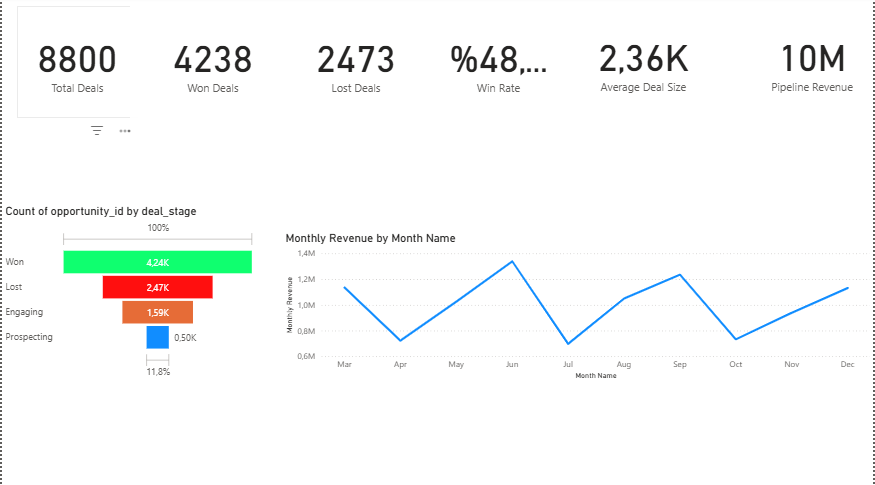
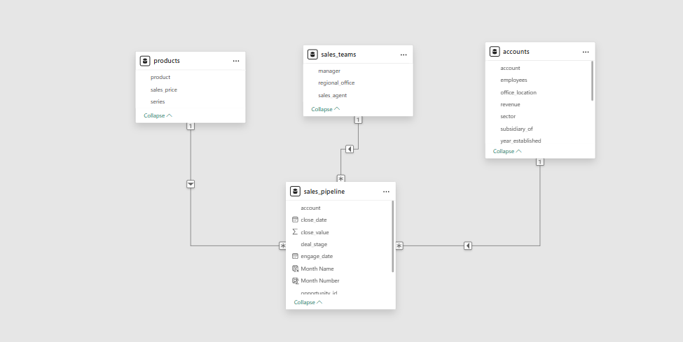

# CRM Sales Funnel & Revenue Dashboard (Power BI)








---

#  CRM Satış Funnel ve Gelir Analizi Dashboard'u

##  Projenin Amacı

Bu projenin amacı, CRM satış verilerini analiz ederek satış pipeline performansını anlamak ve satış sürecindeki fırsatların nasıl ilerlediğini görselleştirmektir.

Power BI kullanılarak geliştirilen bu dashboard sayesinde satış ekipleri:

- satış fırsatlarının pipeline içerisindeki dağılımını
- kazanılan ve kaybedilen fırsatları
- pipeline içerisindeki potansiyel geliri
- satış performansının zaman içerisindeki değişimini

analiz edebilir.

Bu proje, satış ekiplerinin **veriye dayalı kararlar almasına yardımcı olacak bir analiz dashboardu geliştirmeyi amaçlamaktadır.**

---

## Proje Özeti

Bu proje, CRM satış verilerini analiz etmek amacıyla **Power BI kullanılarak oluşturulmuş interaktif bir satış analizi dashboardudur**.

Dashboard, satış pipeline sürecini, kazanılan/kaybedilen fırsatları ve aylık gelir trendlerini analiz etmeyi amaçlamaktadır.

Proje kapsamında **100.000+ satış fırsatını içeren bir CRM veri seti** kullanılmıştır.

Dashboard sayesinde satış ekipleri ve yöneticiler:

- Satış pipeline performansını
- Kazanılan ve kaybedilen fırsatları
- Pipeline içindeki potansiyel geliri
- Aylık gelir trendlerini

tek bakışta analiz edebilir.

---

#  Veri Modeli (Star Schema)

Proje kapsamında Power BI içerisinde **Star Schema veri modeli** oluşturulmuştur.

Kullanılan tablolar:

**Fact Table**

- sales_pipeline

**Dimension Tables**

- accounts
- products
- sales_teams

# Model yapısı:
accounts

sales_pipeline
/
products sales_teams


Bu veri modeli sayesinde analizler **daha hızlı ve optimize şekilde** gerçekleştirilebilir.

---

#  Dashboard İçeriği

Dashboard üç temel analizden oluşmaktadır:

- KPI Analizi
- CRM Funnel Analizi
- Aylık Gelir Trend Analizi

---

#  KPI Metrikleri

Dashboard üzerinde satış performansını ölçmek için **6 temel KPI kartı** oluşturulmuştur.

Kullanılan KPI’lar:

- Total Deals
- Won Deals
- Lost Deals
- Win Rate
- Average Deal Size
- Pipeline Revenue

### Kullanılan DAX Measure'ları

```DAX
Total Deals = COUNT(sales_pipeline[opportunity_id])

Won Deals =
CALCULATE(
    COUNT(sales_pipeline[opportunity_id]),
    sales_pipeline[deal_stage] = "Won"
)

Lost Deals =
CALCULATE(
    COUNT(sales_pipeline[opportunity_id]),
    sales_pipeline[deal_stage] = "Lost"
)

Win Rate =
DIVIDE([Won Deals],[Total Deals])

Average Deal Size =
DIVIDE(
    SUM(sales_pipeline[close_value]),
    [Won Deals]
)

Pipeline Revenue =
SUM(sales_pipeline[close_value])

Bu KPI'lar satış pipeline performansını hızlı şekilde değerlendirmeye yardımcı olur.

# CRM Sales Funnel Analizi

Satış sürecini görselleştirmek için Funnel Chart kullanılmıştır.

# Funnel ayarları:

Category:

deal_stage

Values:

Count of opportunity_id

Funnel içerisinde bulunan aşamalar:

Prospecting

Engaging

Won

Lost

Funnel aşamaları manuel olarak sıralanmış ve her aşama farklı renklerle görselleştirilmiştir.

# Bu görselleştirme sayesinde:

-satış pipeline dağılımı

-kazanılan fırsatlar

-kaybedilen fırsatlar

kolayca analiz edilebilir.

# Aylık Gelir Trend Analizi

Satış performansının zaman içindeki değişimini görmek için Line Chart kullanılmıştır.

Grafik ayarları:

X-Axis:

Month Name

Y-Axis:

Monthly Revenue

# Kullanılan DAX Kolonları

Month Number = MONTH(sales_pipeline[close_date])

Month Name = FORMAT(DATEVALUE(sales_pipeline[close_date]), "MMM")

Bu kolonlar sayesinde aylık gelir trendi analiz edilmiştir.

# Dashboard Insights (Öne Çıkan Analizler)

-Dashboard analizleri şu içgörüleri ortaya koymaktadır:

-Satış fırsatlarının önemli bir kısmı pipeline’ın erken aşamalarında kaybedilmektedir.

-Kazanılan fırsatlar toplam pipeline içerisindeki belirli bir oranı oluşturmaktadır ve bu oran Win Rate metriği ile ölçülmektedir.

-Pipeline Revenue metriği satış pipeline içindeki toplam potansiyel geliri göstermektedir.

-Aylık gelir grafiği satış performansındaki zaman bazlı değişimleri analiz etmeye yardımcı olur.

-Funnel analizi sayesinde satış ekipleri hangi aşamada fırsat kaybettiklerini tespit edebilir.

Bu analizler satış yöneticilerinin pipeline süreçlerini optimize etmesine yardımcı olabilir.


# Kullanılan Araçlar

Power BI

DAX

Data Modeling

Star Schema

Data Visualization


# CRM Sales Funnel & Revenue Dashboard (English)
 Project Objective

The goal of this project is to analyze CRM sales data and visualize the performance of the sales pipeline.

The Power BI dashboard enables sales teams to understand:

-how opportunities move through the pipeline

-win and loss distribution

-total pipeline revenue

-revenue trends over time

The project aims to provide an analytical dashboard that supports data-driven decision making for sales teams.


# Project Overview

This project presents an interactive CRM Sales Analytics Dashboard built with Power BI to analyze sales pipeline data.

The dashboard analyzes:

sales pipeline performance

won and lost opportunities

pipeline revenue

monthly revenue trends

The dataset contains 100,000+ CRM sales opportunities.

# Data Model

A Star Schema data model was implemented in Power BI.

Tables used in the project:

Fact Table:

sales_pipeline

Dimension Tables:

accounts

products

sales_teams

# Schema Structure:

   accounts
             \
              sales_pipeline
             /          \
        products      sales_teams

This structure improves analytical performance and data modeling efficiency.


# Dashboard Components

The dashboard includes three main analysis sections:

KPI Analysis

Sales Funnel Analysis

Monthly Revenue Trend Analysis

# KPI Metrics

The dashboard includes 6 key performance indicators (KPIs):

Total Deals

Won Deals

Lost Deals

Win Rate

Average Deal Size

Pipeline Revenue

^# DAX Measures Used

Total Deals = COUNT(sales_pipeline[opportunity_id])

Won Deals =
CALCULATE(
    COUNT(sales_pipeline[opportunity_id]),
    sales_pipeline[deal_stage] = "Won"
)

Lost Deals =
CALCULATE(
    COUNT(sales_pipeline[opportunity_id]),
    sales_pipeline[deal_stage] = "Lost"
)

Win Rate =
DIVIDE([Won Deals],[Total Deals])

Average Deal Size =
DIVIDE(
    SUM(sales_pipeline[close_value]),
    [Won Deals]
)

Pipeline Revenue =
SUM(sales_pipeline[close_value])

# Sales Funnel Analysis

A Funnel Chart was created to visualize the CRM sales pipeline.

Configuration:

Category:

deal_stage

Values:

Count of opportunity_id

Funnel stages:

Prospecting

Engaging

Won

Lost

The funnel stages were manually ordered and color-coded to improve visual clarity.

# Monthly Revenue Trend

A Line Chart was used to visualize monthly revenue trends.

Configuration:

X-axis:

Month Name

Y-axis:

Monthly Revenue


#DAX Columns
Month Number = MONTH(sales_pipeline[close_date])

Month Name = FORMAT(DATEVALUE(sales_pipeline[close_date]), "MMM")

# Dashboard Insights

The dashboard highlights several key insights:

A large portion of opportunities drop off during early pipeline stages.

The Win Rate metric provides a quick overview of conversion performance.

Pipeline Revenue represents the total potential revenue within the pipeline.

The monthly revenue chart helps analyze revenue trends over time.

Funnel analysis helps sales teams identify where deals are being lost in the pipeline.


# Tools & Skills Used

Power BI

DAX

Data Modeling

Star Schema

Data Visualization


Model yapısı:
